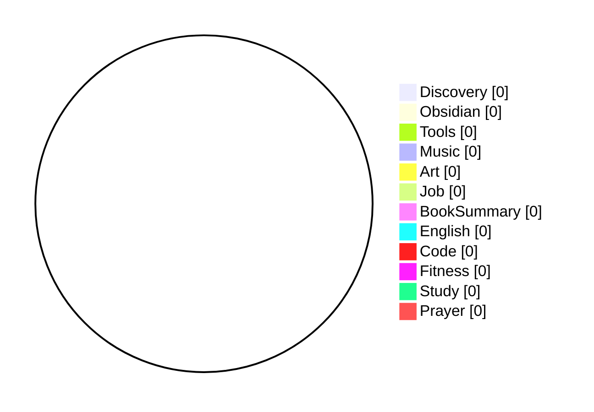

```toc
```

---
Who I Am?
---
1. I am a Muslim.
2. I am a Son of a Happy Family.
3. I am a Grateful Friend.
4. I am a College Students.
5. I am a Secretary General of HMIF.
6. I am a Remote Software Engineer Candidate.

---
What Are My Compound Action?
---
1. Practicing to be a Good Muslim.
2. Practicing to be a Good Family Member.
3. Practicing to be a Good Friend.
4. Practicing to be a Good College Students.
5. Practicing to be a Good Secretary General.
6. Practicing to be a Good Software Engineer.
	1. Learning English.
	2. Learning How to Code.

---
Emoji Code & Rewards
---
5 - 💡 Discovery:: A general new discovery
5 - 🗿 Obsidian:: Anything related to Obsidian
5 - 🛠 Tools:: Anything related to Tool or Resource
5 - 🎶 Music:: Anything related to Music
5 - 🎨 Art:: Anything related to Art
10 - 👔 Job:: Anything related to Job
10 - 📘 BookSummary:: A book summary
20 - 🍀 English:: Anything related to English
20 - ⌨ Code: Anything related to Code
20 - 🏋️ Fitness:: Anything related to Fitness
50 - 📑 Study:: Anything related to College Study
50 - 🕋 Prayer:: Anything related to Muslim Prayer

---
Today's Log
---
- [ ] 
- [ ] 
End of Day 2: I've finished the Free LinkedIn Learning Course. Turns out, even though I've finished the course, the certificate can only be shared and downloaded by a premium subscriber. Here's the project results:
---
Total Points: {0}
---
